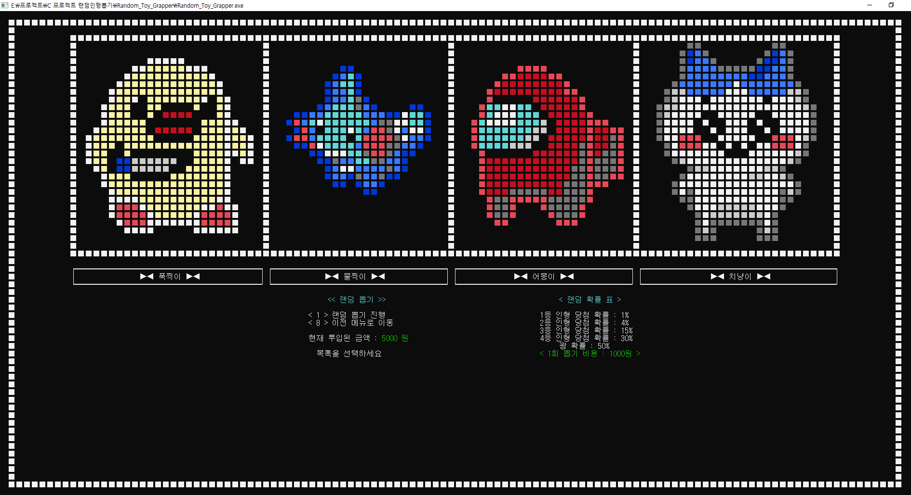

### - 프로젝트명
- 확률 기반 랜덤 인형 뽑기 시뮬레이션 프로그램

### - 개발 환경
- C, Visual Studio 2022

### - 주요 기능
- 지폐 투입, 잔돈 반환
- 랜덤 뽑기
- 선택식 뽑기
- 이전 단계, 다음 단계 이동 가능한 이동식 메뉴 시스템
- 총 5가지 25x25 픽셀의 도트 그래픽의 인형 이미지 출력

### - 구동 과정
#### 1. 프로그램 시작

```c 
void Intro_Effect() // 인트로 화면
{
	for (;;) // 키입력 받을때까지 텍스트가 점멸하며 반복
	{
		textcolor(LIGHTWHITE);
		Make_Frame(); // 테두리 출력
		
		textcolor(YELLOW);
		Intro_Screen(); // 간단한 메인 타이틀 인트로 화면 출력
		
		textcolor(BLUEGREEN);
		Press_Key_Text();

		delay(speed / 4); // 0.2초 대기
		Press_Key_Delete();
		if (_kbhit()) // 키 입력 받으면 탈출
		{
			break;
		}
		delay(speed / 4);
		if (_kbhit())
		{
			break;
		}
		
	}
}
```

- 프로그램을 시작하면 Intro 화면이 출력되고, 하단의 <Press Any Key To Start> 문구가 점멸.
- 키보드 입력을 누르면 메인 메뉴 화면으로 진입.
  


#### 2. 메인 메뉴

```c
for (;;)	// 메인 메뉴 무한 반복
{
	cls;
	start = 0;		// 플래그 변수
	Make_Frame();
	Main_Screen(main_screen_start_x, main_screen_start_y); // 메뉴 선택 화면 좌표값에 출력
	menu_select = _getch();
	
	switch (menu_select) // 메인 메뉴 숫자 입력
	{
      // case '1': ...
      // case '2': ...
      // case '3': ...
      // deafult: ...
  }
}
```

- 메인 메뉴에서 1번 키 입력시 선택 뽑기 진입, 2번 키를 누르면 랜덤 뽑기 진입, 3번 키를 누르면 프로그램 종료.

#### 3. 랜덤 뽑기 메뉴
  
  ```c
case '2': // 2번 메뉴 랜덤 뽑기 메뉴 진입
{
	start = 0; // 플래그 변수 초기화 //
	for (;start == 0;) // 플래그 변수 0일경우 무한 반복
	{	// 금액 투입 반복
		cls;
		int input = 0;
		Machine_Screen(); // 인형 목록
		Make_Frame();
		Clear(screen_bottom_start_x, screen_bottom_start_y); // 해당위치에서 일정 수만큼의 화면만 지움
		Random_Game_Screen_Print(random_screen_start_x, random_screen_start_y); // 해당 좌표에 확률 표 출력
		Cash_System_Print(cash_system_start_x, cash_system_start_y); // 금액 투입 메뉴 좌표에 출력
		input = _getch();
		Cash_System_Calculate(input, cash_system_start_x, cash_system_start_y + 15); // 계산 및 좌표에 출력

		for (; start == 1;) // 랜덤 게임 진행 반복
		{
			int random_select = 0;
			Clear_Random(screen_bottom_start_x, screen_bottom_start_y); // 랜덤메뉴 하단부 영역 지우기
			Machine_Screen();
			Make_Frame();
			Random_Game_Screen_Print(random_screen_start_x, random_screen_start_y); // 확률표
			Random_Game_Message(cash_system_start_x, cash_system_start_y); // 랜덤 뽑기 메뉴
			random_select = _getch();
			Random_Game_Start(random_select, cash_system_start_x, cash_system_start_y + 10); // 랜덤 뽑기 진행
			
		}
		if (start == -1)
		{
			break;
		}
	} // for (start == 0);
	break;
} // case 2 :
  ```

- 2번 랜덤 뽑기 진입시 먼저 금액을 투입해야하며, 투입된 금액이 없으면 다음 단계 진행 불가능.

#### 4. 금액 투입 및 다음 단계 진행


```c
    void Cash_System_Calculate(int cash_select, int x, int y) // 금액 투입 시스템
{
	char str[50];
	gotoxy(x, y);
	switch (cash_select) // 지폐 선택
	{
	case '1': // 5만원권을 선택한경우
	{
		textcolor(YELLOW);
		strcpy(str,"< 5만원권을 투입하였습니다 >");
		Text_Effect(str);
		textcolor(text_color);
		total_cash = total_cash + 50000;
		delay(speed);
		break;
	}
	case '2': // 1만원권 
	case '3': // 5천원권
	case '4': // 1천원권
	case '7': // 환불
	{
		if (total_cash > 0)
		{
			textcolor(YELLOW);
			strcpy(str, "< 전액 환불 처리 되었습니다. >");
			Text_Effect(str);
			gotoxy(x, y + 1);
			strcpy(str, "환불 금액 : ");
			Text_Effect(str);
			printf("%d", total_cash);
			strcpy(str, "원");
			Text_Effect(str);
			textcolor(text_color);
			total_cash = 0;
			delay(speed);
			break;
		}
		else
		{
			textcolor(LIGHTRED);
			strcpy(str, "< 환불할 금액이 없습니다. >");
			Text_Effect(str);
			textcolor(text_color);
			total_cash = 0;
			delay(speed);
			break;
		}
	}
	case '8': // 뒤로가기
	{
		textcolor(YELLOW);
		strcpy(str, "<<< 이전 메뉴로 이동합니다 >>>");
		Text_Effect(str);
		textcolor(text_color);
		delay(speed);
		start = -1; // 이전 메뉴로 이동
		break;
	}
	case '9': // 투입 완료
	{
		if (total_cash >= 1000)
		{
			textcolor(LIGHTGREEN);
			strcpy(str, "<<< 다음 단계로 이동합니다 >>>");
			Text_Effect(str);
			textcolor(text_color);
			start = 1; // 인형 뽑기로 진입
			delay(speed);
			break;
		}
		else if (total_cash < 1000)
		{
			textcolor(LIGHTRED);
			strcpy(str, "< 금액을 투입해주세요 >");
			Text_Effect(str);
			textcolor(text_color);
			delay(speed);
			break;
		}
		
	}
	default:
	{
		strcpy(str, "잘못된 입력입니다.");
		Text_Effect(str);
		delay(speed);
		break;
	}
	}
}
```

- 5만원권~1만원권 지폐를 원하는 만큼 투입 한 후 다음 단계 메뉴를 눌러서 최종 뽑기 메뉴로 진입 가능.


#### 5. 랜덤 뽑기 진행

```c
void Random_Game_Start(int game_menu_select,int x, int y) // 랜덤 게임 진행 함수
{
	int start_x = 16;
	int start_y = 36;
	char str[50];
	int dice = random(100); // dice 랜덤 (0~99)
	gotoxy(x, y);
	switch (game_menu_select)
	{
	case '1': // 진행을 선택했는데,
	{
		if (total_cash < random_cost) // 돈이 부족한경우
		{
			textcolor(LIGHTRED);
			strcpy(str, "투입 금액이 부족합니다.");
			Text_Effect(str);
			textcolor(text_color);
			delay(speed);
			break;
		}
		else if (total_cash >= random_cost) // 돈이 충분한경우
		{
			textcolor(LIGHTGREEN);
			strcpy(str, "  < 뽑기를 진행합니다 >");
			Text_Effect(str);
			textcolor(text_color);
			delay(speed);
			total_cash = total_cash - random_cost;
			gotoxy(x, y + 2);
			if (dice < 1) // 1% (1등)
			{
				textcolor(BLUEGREEN);
				strcpy(str, "★★★ 1등 당첨 !!! ★★★");
				Text_Effect(str);
				textcolor(text_color);
				Make_Image(doll_image_01, start_x, start_y);
				delay(speed*2);
			}
			else if (dice >= 1 && dice < 5) // 4% (2등)
			{...}
			else if (dice >= 5 && dice < 20) // 15% (3등)
			{...}
			else if (dice >= 20 && dice < 50) // 30% (4등)
			{...}
			else if (dice >= 50 && dice < 100) // 50% (5등)
			{...}
			else
			{
				printf("알 수 없는 오류");
				delay(speed);
			}
			Delete_Image(start_x, start_y);
		}
		break;
	}
	case '8': // 뒤로 이동
	{
		start = 0;
		textcolor(YELLOW);
		printf("이전 메뉴로 이동합니다.");
		textcolor(text_color);
		delay(speed);
		break;
	}
	default :
	{
		printf("잘못된 입력입니다.");
		delay(speed);
		break;
	}
	}
}
```

- 랜덤 게임 진행 버튼을 누르면 금액이 차감되며 확률에 따라 인형이 뽑힘.

#### 6. 프로그램 종료

```c
void Make_Image(int image[25][25],int x, int y) // 해당 좌표에 이미지 출력
{
	for (int i = 0; i < 25; i=i+1) // y
	{
		for (int j = 0; j < 25; j=j+1) // x
		{
			gotoxy(x+(j*2), y+i); // 전달한 시작 좌표로 이동
			textcolor(image[i][j]); // 해당 픽셀값 전달하여 색상변환
			printf(doll_shape);
		}
	}
	textcolor(text_color); // 출력 다 끝나고 초기 색상으로 리셋
}
void Exit_Screen(int x, int y) // 종료시 캐릭터 전부 보여주며 종료하는 함수
{
	cls;
	Make_Image(doll_image_01, 4, 4);
	Make_Image(doll_image_02, 170, 4);
	Make_Image(doll_image_04, 4, 30);
	Make_Image(doll_image_03, 170, 30);
	Make_Image(doll_image_05, 87, 17);
	gotoxy(x, y);
	textcolor(BLUEGREEN);
	printf("다음에 또봐요~~~\n");
}
```
- 메인 메뉴에서 종료를 선택할 경우 모든 인형 이미지를 각각의 특정 위치에 출력하며 종료.
  
