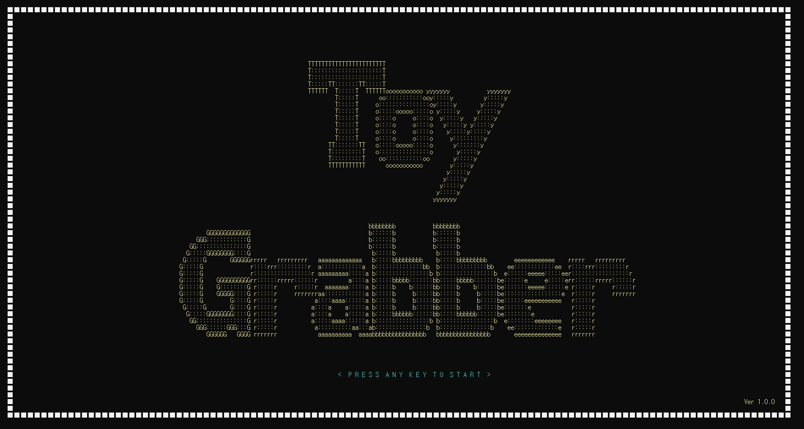
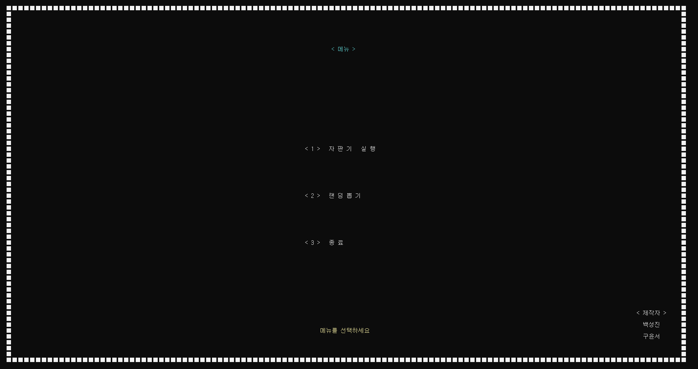
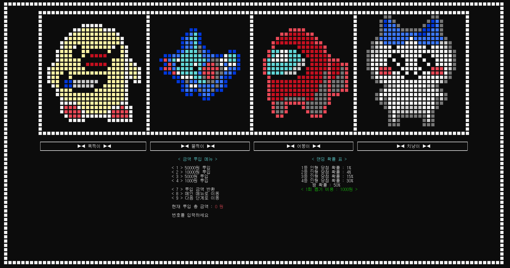
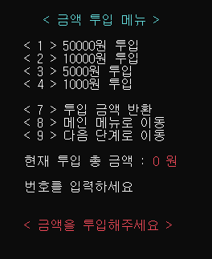
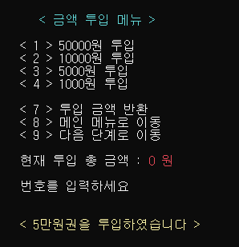
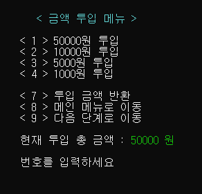
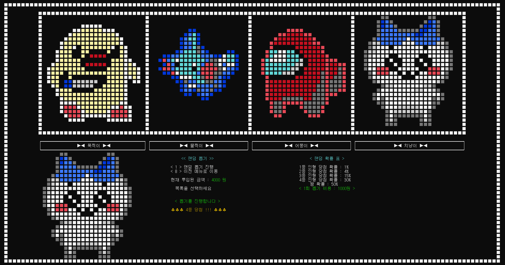
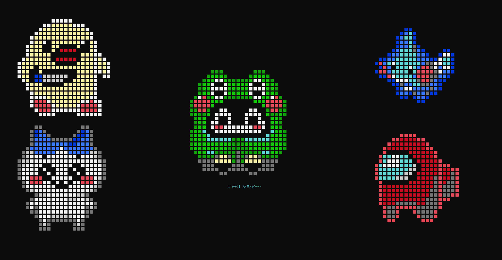

### - 프로젝트명
- 확률형 랜덤 인형 뽑기 시뮬레이션 프로그램

### - 개발 환경
- C, Visual Studio 2022

### - 주요 기능
- 지폐 투입, 잔돈 반환
- 선택식 인형 뽑기
- 랜덤 인형 뽑기
- 이전 단계, 다음 단계 이동 가능한 이동식 메뉴 시스템
- 5종류 25x25 픽셀 도트 그래픽의 인형 이미지 출력

### - 구동 과정
#### 1. 프로그램 시작



- 프로그램을 시작하면 Intro 화면이 출력되고, 하단의 <Press Any Key To Start> 문구가 점멸합니다.
- 키보드 입력을 누르면 메인 메뉴 화면으로 진입 됩니다.

```c
void Make_Frame() // 테두리 출력
{
	int left = 2;
	int right = 232;
	int top = 1;
	int bottom = 61;

	textcolor(frame_color);

	gotoxy(left, top);
	for (int i = left; i <= right; i = i + 2) { printf(frame_shape); } // 상단 테두리

	gotoxy(left, bottom);
	for (int i = left; i <= right; i = i + 2) { printf(frame_shape); } // 하단 테두리

	gotoxy(left, top);
	for (int i = top; i <= bottom; i = i + 1) { gotoxy(left, i); printf(frame_shape); } // 좌측 테두리

	gotoxy(right, top);
	for (int i = top; i <= bottom; i = i + 1) { gotoxy(right, i); printf(frame_shape); } // 우측 테두리
}

void Intro_Effect() // 인트로 화면
{
	Make_Frame();

	textcolor(YELLOW);
	Intro_Screen();	 	// 도트 이미지 출력

	textcolor(BLUEGREEN);

	for (;;) // 하단 문구 점멸 하며 키 입력 받기
	{
		Press_Key_Text();

		delay(speed / 4);		// 200ms
		
		Press_Key_Delete();

		if (_kbhit()){ break; }

		delay(speed / 4);

		if (_kbhit()){ break; }
		
	}
}

void main() 
{
	int main_screen_start_x = 104; // 메뉴 선택화면 출력 좌표
	int main_screen_start_y = 25;
	int cash_system_start_x = 80; // 금액 투입 문구 출력 좌표
	int cash_system_start_y = 37;
	int random_screen_start_x = 140; // 랜덤 확률표 문구 출력 좌표
	int random_screen_start_y = 37;
	int screen_bottom_start_x = 16; // 하단 문구 제거 시작 좌표
	int screen_bottom_start_y = 36;

	int menu_select = 0;	// 메인 메뉴 선택 변수
	int cash_select = 1;	// 투입 금액 변수
	char str[50];		// 텍스트 애니메이션을 텍스트를 담을 변수

	ShowWindow(GetConsoleWindow(), SW_MAXIMIZE);		// 창크기 전체화면
	setcolor(LIGHTWHITE, BLACK);		// 기본 글자 색상 (뒤에값은 글자뒤 배경색)
	setcursortype(NOCURSOR);		// 커서 타입 없음
	randomize();				// 랜덤화 사용
	Randomize_Doll_Stock(5);		// 선택뽑기의 재고 배정 (랜덤 1~5개)

	Intro_Effect();				// 인트로 화면 출력
	textcolor(LIGHTWHITE);

	// 이하 하단 기제...
}

```

---

#### 2. 메인 메뉴



- 메인 메뉴에서 1번 키 입력시 선택 뽑기 진입, 2번 키를 누르면 랜덤 뽑기 진입, 3번 키를 누르면 프로그램을 종료합니다.

```c
void Main_Screen(int x, int y) // 메인 메뉴
{
	int Distance = 4;
	int Creater_x = 212;
	int Creater_y = 53;
	int Creater_Distance = 1;

	textcolor(BLUEGREEN);
	gotoxy(110, 8);				printf("   < 메뉴 >");

	textcolor(text_color);
	gotoxy(x, y);				printf("< 1 >   자 판 기   실 행");
	gotoxy(x, y + Distance * 1); printf("");
	gotoxy(x, y + Distance * 2); printf("< 2 >   랜 덤 뽑 기");
	gotoxy(x, y + Distance * 3); printf("");
	gotoxy(x, y + Distance * 4); printf("< 3 >   종 료");
	gotoxy(x, y + Distance * 5); printf("");

	textcolor(YELLOW);
	gotoxy(100, 56);			printf("         메뉴를 선택하세요");

	textcolor(text_color);
	gotoxy(Creater_x, Creater_y);	  printf("     < 제작자 >");
	gotoxy(Creater_x, Creater_y + 1); printf("");
	gotoxy(Creater_x, Creater_y + 2); printf("       백성진");
	gotoxy(Creater_x, Creater_y + 3); printf("");
	gotoxy(Creater_x, Creater_y + 4); printf("       구윤서");
}

void main() 
{
	for (;;)	// 메인 메뉴 무한 반복
	{
		start = 0;		// 플래그 변수 초기화

		cls;			// 화면 지움
		Make_Frame();	// 테두리
		Main_Screen(main_screen_start_x, main_screen_start_y); // 메인 메뉴 선택 화면

		menu_select = _getch();
		
		switch (menu_select)
		{
		// case '1': ...
		// case '2': ...
		// case '3': ...
		// deafult: ...
		}
  	}
}
```

---

#### 3. 랜덤 뽑기 메뉴 진입



- 뽑기 메뉴로 진입하면 먼저 인형 목록이 상단에 출력되며, 금액 투입 시스템이 작동합니다.
- 화면 하단에서 금액 투입 시스템 정보를 확인할 수 있습니다.

```c
case '2': // 랜덤 뽑기 메뉴 진입
{
	start = 0; // 플래그 변수 초기화

	for ( ; start == 0 ; )
	{	
		cls;
		int input = 0;

		Machine_Screen();	// 인형 목록
		Make_Frame();		// 테두리
		Clear(screen_bottom_start_x, screen_bottom_start_y);			// 하단부 영역 초기화
		Random_Game_Screen_Print(random_screen_start_x, random_screen_start_y); // 확률표
		Cash_System_Print(cash_system_start_x, cash_system_start_y);		// 금액 투입 메뉴

		input = _getch();
		Cash_System_Calculate(input, cash_system_start_x, cash_system_start_y + 15); // 금액 투입 계산 및 좌표에 출력

		for ( ; start == 1 ; )	// 랜덤 게임 진행 반복
		{
			int random_select = 0;

			Clear_Random(screen_bottom_start_x, screen_bottom_start_y);		// 하단부 영역 초기화 (넓게)
			Machine_Screen();
			Make_Frame();
			Random_Game_Screen_Print(random_screen_start_x, random_screen_start_y); // 확률표
			Random_Game_Message(cash_system_start_x, cash_system_start_y);		// 랜덤 뽑기 메뉴

			random_select = _getch();
			Random_Game_Start(random_select, cash_system_start_x, cash_system_start_y + 10); // 랜덤 뽑기 진행
		}

		if (start == -1) { break; } // 이전 메뉴 이동

	} // for (start == 0)

	break;

} // case 2
```

```c
void Cash_System_Print(int x, int y) // 금액 투입 시스템 화면
{
	int Distance = 1;

	textcolor(BLUEGREEN);
	gotoxy(x, y);				 printf("   < 금액 투입 메뉴 >"); textcolor(text_color);
	gotoxy(x, y + Distance * 1); printf("");
	gotoxy(x, y + Distance * 2); printf("< 1 > 50000원 투입");
	gotoxy(x, y + Distance * 3); printf("< 2 > 10000원 투입");
	gotoxy(x, y + Distance * 4); printf("< 3 > 5000원 투입");
	gotoxy(x, y + Distance * 5); printf("< 4 > 1000원 투입");
	gotoxy(x, y + Distance * 6); printf("");
	gotoxy(x, y + Distance * 7); printf("< 7 > 투입 금액 반환");
	gotoxy(x, y + Distance * 8); printf("< 8 > 메인 메뉴로 이동");
	gotoxy(x, y + Distance * 9); printf("< 9 > 다음 단계로 이동");
	gotoxy(x, y + Distance * 10); printf("");
	gotoxy(x, y + Distance * 11); printf("현재 투입 총 금액 : ");

	if (total_cash == 0) { textcolor(LIGHTRED); }
	else if (total_cash >= 1000) { textcolor(LIGHTGREEN); }

	printf("%d 원", total_cash);

	gotoxy(x, y + Distance * 12); printf(""); textcolor(text_color);
	gotoxy(x, y + Distance * 13); printf("번호를 입력하세요 ");
}
```

---

#### 4. 금액 투입 및 다음 단계 진행





- 해당하는 숫자 버튼을 눌러서, 종류별 지폐를 원하는 만큼 투입 한 후 다음 단계 메뉴 버튼을 누르면 랜덤 뽑기 단계로 진입됩니다.
- 환불 및 이전 메뉴로 돌아가기 또한 가능합니다.

```c
void Cash_System_Calculate(int cash_select, int x, int y) // 금액 투입 시스템 기능
{
	char str[50];
	int color = 0;
	int refund = 0;

	gotoxy(x, y);
	switch (cash_select) // 지폐 선택
	{
	case '1': // 5만원권
	{
		color = YELLOW;
		strcpy(str,"< 5만원권을 투입하였습니다 >");
		total_cash = total_cash + 50000;
		break;
	}
	case '2': { ... } // 1만
	case '3': { ... } // 5천
	case '4': { ... } // 1천
	case '7': // 환불
	{
		if (total_cash > 0)
		{
			color = YELLOW;
			strcpy(str, "< 전액 환불 처리 되었습니다. >");
			refund = 1;
		}
		else
		{
			color = LIGHTRED;
			strcpy(str, "< 환불할 금액이 없습니다. >");
		}
		break;
	}
	case '8': // 뒤로 가기
	{
		color = YELLOW;
		strcpy(str, "<<< 이전 메뉴로 이동합니다 >>>");
		start = -1; // 이전 메뉴로 이동
		break;
	}
	case '9': // 투입 완료
	{
		if (total_cash >= min_cost)
		{
			color = LIGHTGREEN;
			strcpy(str, "<<< 다음 단계로 이동합니다 >>>");
			start = 1;	// 다음 단계로 진입
		}
		else
		{
			color = LIGHTRED;
			strcpy(str, "< 금액을 투입해주세요 >");
		}
		break;
	}
	default:
	{
		strcpy(str, "잘못된 입력입니다.");
		break;
	}
	}

	textcolor(color);
	Text_Effect(str);

	if (refund == 1)
	{
		gotoxy(x, y + 1);
		strcpy(str, "환불 금액 : ");
		Text_Effect(str);
		printf("%d원", total_cash);
		total_cash = 0;
	}

	delay(speed);
	textcolor(text_color);
}

void Text_Effect(char text[]) // 텍스트 재생 애니메이션 효과
{
	for (int i = 0; text[i] != '\0'; i++)
	{
		putchar(text[i]);
		delay(text_speed);
	}
}
```

---

#### 5. 랜덤 뽑기 진행



- 랜덤 뽑기 진행 키를 누르면 금액이 차감되며 확률에 따라 다른 인형이 특정 위치에 출력되며 뽑힙니다.
- 금액이 모두 소진되면 진행이 불가능하며, 중단하기를 원하면 이전 메뉴 이동 키를 눌러서 이전 메뉴로 돌아갈 수 있습니다.

```c
void Random_Game_Start(int game_menu_select,int x, int y) // 랜덤 게임 진행 함수
{
	int start_x = 16;
	int start_y = 36;
	char str[50];
	int dice = random(100); // dice를 랜덤화 (0~99) 값 중에 1개 랜덤 배정

	gotoxy(x, y);
	switch (game_menu_select)
	{
	case '1': // 진행을 선택했는데
	{
		if (total_cash < random_cost) // 돈이 부족한경우
		{
			textcolor(LIGHTRED);
			strcpy(str, "투입 금액이 부족합니다.");
			Text_Effect(str);
			textcolor(text_color);
			delay(speed);
			break;
		}
		else if (total_cash >= random_cost) // 돈이 충분한경우
		{
			textcolor(LIGHTGREEN);
			strcpy(str, "  < 뽑기를 진행합니다 >");
			Text_Effect(str);
			textcolor(text_color);
			delay(speed);
			total_cash = total_cash - random_cost;
			gotoxy(x, y + 2);

			if (dice < 1) // 1%
			{
				textcolor(BLUEGREEN);
				strcpy(str, "★★★ 1등 당첨 !!! ★★★");
				Text_Effect(str);
				textcolor(text_color);
				Make_Image(doll_image_01, start_x, start_y);
				delay(speed*2);
			}
			else if (dice >= 1 && dice < 5) // 4%
			{ ... }
			else if (dice >= 5 && dice < 20) // 15%
			{ ... }
			else if (dice >= 20 && dice < 50) // 30%
			{ ... }
			else if (dice >= 50 && dice < 100) // 50%
			{ ... }
			else
			{
				printf("dice 랜덤값 에러");
				delay(speed);
			}
			Delete_Image(start_x, start_y);
		}
		break;
	}
	case '8': // 뒤로 이동
	{
		start = 0;
		textcolor(YELLOW);
		printf("이전 메뉴로 이동합니다.");
		textcolor(text_color);
		delay(speed);
		break;
	}
	default :
	{
		printf("잘못된 입력입니다.");
		delay(speed);
		break;
	}
	}
}

void Make_Image(int image[25][25],int x, int y) // 해당 좌표에 이미지 출력
{
	for (int i = 0; i < 25; i=i+1) // y
	{
		for (int j = 0; j < 25; j=j+1) // x
		{
			gotoxy(x+(j*2), y+i); // 각 좌표로 이동
			textcolor(image[i][j]); // 해당 픽셀값 전달하여 색상변환
			printf(doll_shape);
		}
	}
	textcolor(text_color); // 출력 다 끝나고 초기 색상으로 리셋
}

void Delete_Image(int x, int y) // 해당 좌표의 인형 이미지 삭제
{
	for (int i = 0; i < 25; i = i + 1)
	{
		for (int j = 0; j < 25; j = j + 1)
		{
			gotoxy(x + (j * 2), y + i);
			printf("  ");
		}
	}
}
```

---

#### 6. 프로그램 종료



- 메인 메뉴에서 3번인 종료를 선택할 경우, 모든 인형이 특정 위치에 출력되며 프로그램이 정상 종료됩니다.
  
```c
void Exit_Screen() // 종료시 화면
{
	int left = 4;
	int right = 170;
	int top = 4;
	int bottom = 30;

	int center_x = 87;
	int center_y = 17;

	int text_x = 107;
	int text_y = 44;

	cls;
	Make_Image(doll_image_01, left, top);
	Make_Image(doll_image_02, right, top);
	Make_Image(doll_image_04, left, bottom);
	Make_Image(doll_image_03, right, bottom);
	Make_Image(doll_image_05, center_x, center_y);

	gotoxy(text_x, text_y); textcolor(BLUEGREEN); printf("다음에 또봐요~~~\n");
}

void main(){

	// 생략 //

	case '3' : // 종료
	{
		cls;
		Exit_Screen();
		delay(2000);
		cls;
		exit(0);
	}
	default:
	{
		rewind(stdin);
		break;
	}
}
```


